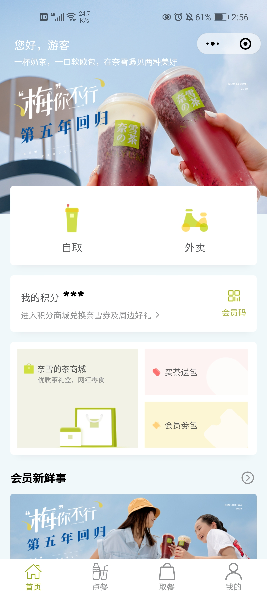
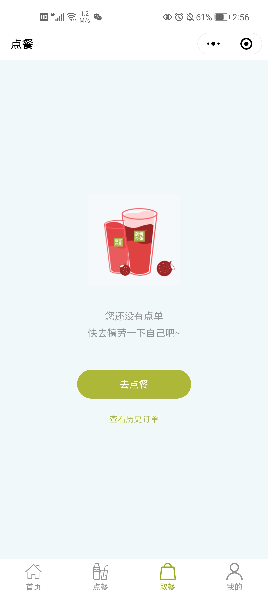
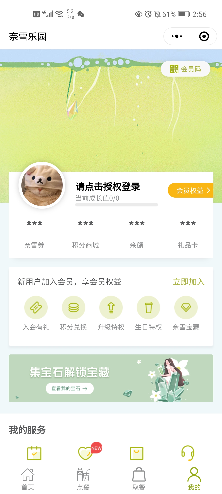
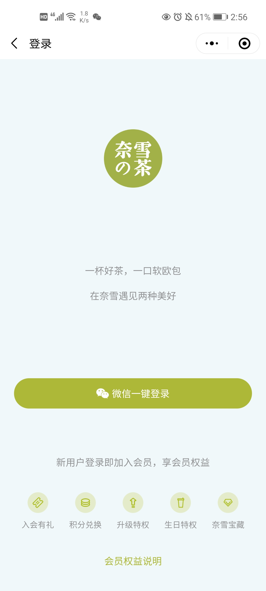

**特别声明：本项目中的展示图片归奈雪の茶所有。如果侵权，请联系删除。**

请联系QQ``122874722``。

### 简介

一套仿奈雪の茶小程序的项目模板。

本项目仿写 ``tinypuppet`` 的uni-app项目。

原项目地址: [https://github.com/tinypuppet/nxdc-milktea](https://github.com/tinypuppet/nxdc-milktea)。

原项目使用 HBuilderX 开发，本项目使用 vue-cli 的方式创建项目，并且使用 typescript 开发。

项目兼容H5，微信小程序，支付宝小程序，安卓app，其余未测试。

### 项目使用技术栈

本项目使用到的技术栈如下：
* Vue全家桶
* Typescipt

## 加入项目

如果想加入本项目的开发，需将项目fork到自己的仓库下，功能开发完成后，提PR即可。

### 功能说明

在原作者实现的功能基础上，新增如下功能：

1. 新增功能：

	- 券包购买
	- 积分签到
	- 积分兑换
	- 新增地址
	- 修改地址
	- 余额充值
	- 地图定位
	- 订单用券
	- 查看头像
	- 更换头像
	- 动态订单

2. 所有数据都是静态的，保存在api文件夹下。
### 项目运行

启动项目

```
yarn install
```

```
yarn serve
```

项目打包

```
h5端：
yarn build:h5

微信小程序：
yarn build:mp-weixin

支付宝小程序：
yarn build:mp-alipay
```

### 项目效果图

|首页|点餐|取餐|我的|登录|
|---|---|---|---|---|
||||||
## 写在最后

* 本项目仅用于学习使用，切勿用于商业用途，否则产生的法律后果与作者无关。
